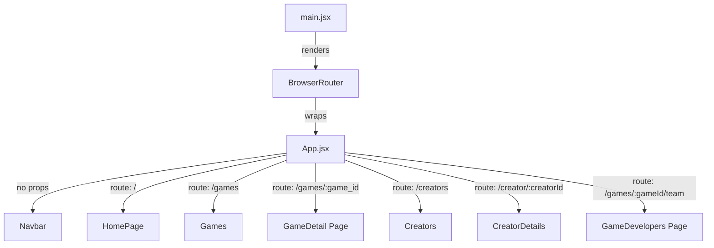
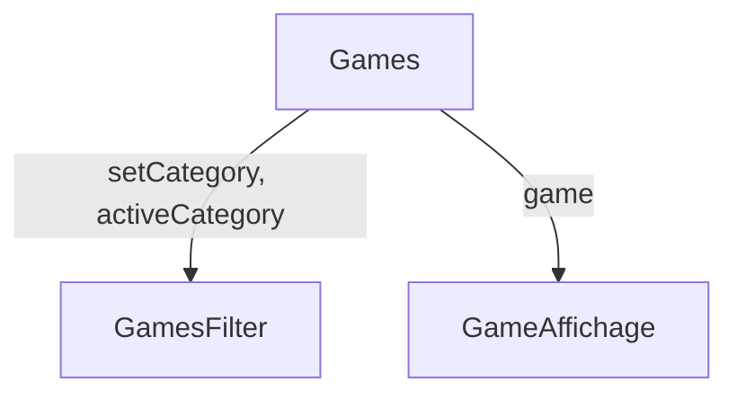
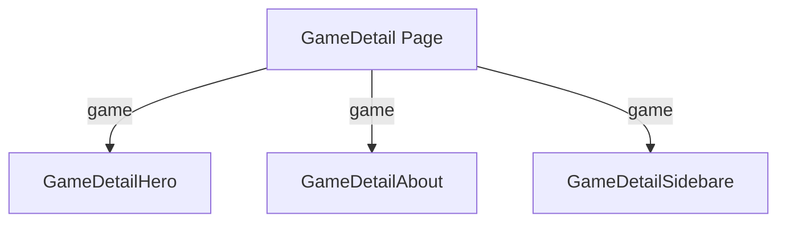
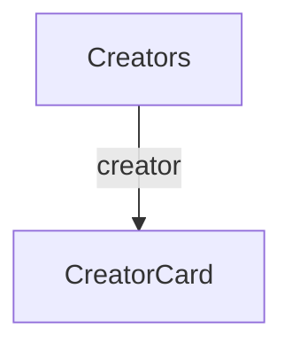
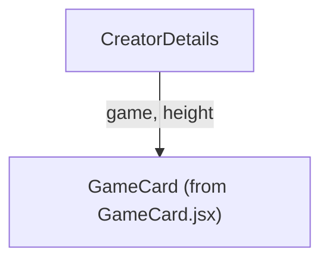
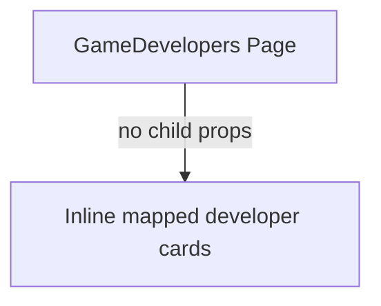
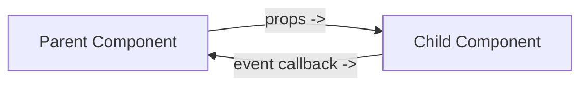

# Component Prop Schema

## Global App Tree



## Home Page Props Flow

```mermaid
flowchart TD
  HomePage["HomePage"] -->|game = topRated[3]| HeroSection["HeroSection"]
  HomePage -->|games = trending| TrendingSection["TrendingSection"]
  HomePage -->|games = topRated| TopRatedSection["TopRatedSection"]
  HomePage -->|games = spotlight| SpotlightSection["SpotlightSection"]

  HeroSection -->|state = stat| StatBox["StatBox"]
  TrendingSection -->|game, index| GameCard["GameCard"]
  TopRatedSection -->|game, height| GameCardTest["GameCardTest"]
```

## Games Page Props Flow



## Game Detail Page Props Flow



## Creators Page Props Flow



## Creator Details Page Props Flow



## Game Developers Page Props Flow



## Props Direction Summary



